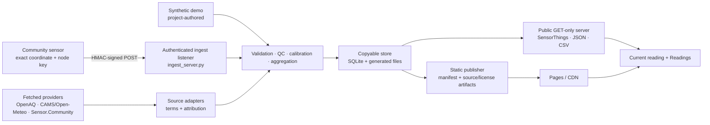

# swelter architecture

swelter is a local-first environmental-data pipeline with two deliberately separate network
surfaces: an authenticated node ingest listener and a public read-only data server. The same store
can also be baked into a fully static artifact for Pages, object storage, or another CDN.

Author/owner: Chelsea Kelly-Reif. Last verified: 2026-07-31. Recheck cadence: every release and any
change to trust boundaries, store layout, public routes, publication artifacts, or source adapters.

Related: [API reference](api.md), [calibration](calibration.md), [data cards](data-cards/README.md),
[decision log](adr/README.md), [threat model](audits/threat-model.md), and
[operations runbook](runbooks/operations.md).

## System context



Data moves from measurement to derived claims. Raw observations are never modified by a downstream
view. Calibration writes distinct derived observations; aggregation, exports, alerts, briefs, and
visualization can all be rebuilt from raw data and versioned correction/context inputs.

## Trust boundaries

| Boundary | Accepted input | Control | Important residual risk |
|---|---|---|---|
| Node → ingest listener | Signed JSON payload | Known-node HMAC, timestamp window, body hash, schema/QC, quarantine | Compromised node key can sign plausible false measurements |
| Provider → adapter | Remote API response | TLS, timeout/size/schema/boundary checks, provenance, source-specific terms | Provider correctness, availability, and metadata completeness remain external dependencies |
| Pipeline → store | Parsed observations and generated evidence | Idempotent key, content hash, immutable raw rows, integrity verification | An operator with filesystem access can replace the store and evidence together |
| Store → public server | Local SQLite/generated files | GET-only routing, path containment, response limits/cache validators | stdlib server belongs behind a trusted proxy/CDN for hostile public traffic |
| Store → static artifact | Generated surfaces/exports/manifests | Fail-closed source truth and license checks, hashes, illustrative-fixture exclusion | CI/cache compromise and platform trust remain; governance exception is issue #105 |
| Browser → device APIs | User-initiated geolocation and preferences | Explicit permission, in-memory nearest-cell lookup, local clear control, no RUM | Browser/extension/device controls remain outside swelter |

The complete data inventory, including localStorage, URL fragments, service worker, Actions cache,
and precise coordinates, is in [`audits/data-flow.md`](audits/data-flow.md).

## Processing model

### 1. Intake

`ingest.py` converts wide payloads into long-format `Observation` records. Each record carries one
parameter plus node id, UTC time, unit, QC state, calibration state, and uncertainty. Malformed
payloads are written to `quarantine.jsonl`; unknown fields do not silently become schema.

`ingest_server.py` is the network write boundary. It loads an operator-local mode-0600 key file,
authenticates node/timestamp/body, rejects replay or impersonation attempts, and invokes the same
intake path. It is not routed through `server.py`.

Source adapters under `sources/` normalize fetched data through the same downstream model while
retaining source, model/physical-sensor status, attribution, and license evidence. OpenAQ uses an
explicit `source-license-ledger.json` contract; publication fails if the required ledger is absent.

### 2. Quality control and calibration

`qc.py` labels range, spike, flatline, missingness, gaps, health, and optional sensor-twin agreement.
It does not delete inconvenient readings. Twin agreement is precision evidence, not accuracy or a
calibration tier.

`calibrate.py` fits versioned corrections from co-location pairs and records method, coefficients,
reference, window, sample size, fit statistics, and residual uncertainty. Applying a correction
creates a new calibrated observation beside the raw observation. A missing or inapplicable correction
leaves the value raw/provisional.

Derived heat metrics remain explicit. Heat index derived from calibrated inputs retains that lineage;
estimated WBGT is labelled estimated and has no occupational guidance band because this implementation
does not include a black-globe radiation term.

### 3. Aggregation and action surfaces

`aggregate.py` groups observations into published grid cells and hourly buckets. It prefers applicable
calibrated/QC-clean members, propagates provisional state and uncertainty, preserves missing buckets,
and produces the records used by the API and browser. Compound exposure, AQI window, and source caveats
are derived fields, not replacements for the underlying measurements.

`alerts.py`, `exposure_brief.py`, `cooling_centers.py`, `context_layers.py`, `ac_access_layer.py`, and
`redlining_layer.py` turn the surface into optional action/context views. Context is descriptive and
sourced; it is not a person-level risk score. Illustrative fixtures are allowed in the synthetic demo
but barred from public production artifacts.

### 4. Read, export, and publish

`api.py`, `dictionary.py`, `export.py`, and `server.py` provide the read-only OGC SensorThings subset,
data dictionary, JSON/CSV, health, surface, alert, context, and static routes documented in
[`api.md`](api.md). `server.py` accepts GET only. It uses bounded reads, request timeouts, cache
invalidation, ETags, and conditional responses, but remains a small stdlib reference server rather
than an Internet-facing application server.

`swelter publish` writes the static site and generated data artifacts plus a content manifest. The
initial `sample-surface.json` contains only the newest bucket for first paint;
`surface-24h.json` and `surface-7d.json` retain their full publication windows for background history
enrichment. A live-provider build includes the correct source/license evidence and refuses unsafe
fallback. Each static route's `demo.json` names the source that actually won that route's configured
fallback chain, including its geography, terminology, calibration posture, and reuse terms. A route
that falls back to the California surface retains the California basemap. Static Pages does not expose
ingest and is only as current as the last successful publication.

`snapshot.py` freezes citable observation/correction/surface artifacts with hashes and dataset citation
metadata. The snapshot's license describes its actual source set; the software `CITATION.cff` is not a
data-license declaration.

## Store and integrity

The shipped store is a directory, not a database service:

```text
store/
├── observations.db       # SQLite raw + calibrated observations
├── quarantine.jsonl      # refused/malformed input with bounded reasons
├── corrections.yaml      # versioned calibration registry
├── aggregate.geojson     # rebuildable published surface
├── digests.jsonl         # optional chained archive-integrity evidence
└── run-manifest.json     # stage counters/source/freshness evidence when produced
```

`SqliteStore` is the implemented backend. The `Store` protocol leaves room for another backend, but
there is no current Parquet/Arrow implementation and no documentation should imply otherwise.

The observation identity includes `(node_id, timestamp, parameter, source, calibration)`. Raw writes
use idempotent insert semantics without collapsing records from distinct sources.
`drop_calibrated()` can remove only derived rows before a rebuild.
`verify-archive` recomputes stored row hashes and a deterministic daily digest chain; comparison with a
previously published head detects later replacement, but an adversary controlling both the store and
all external evidence can still rewrite them together.

## Browser architecture

The observatory is plain HTML, CSS, and ES modules. It reads live JSON from the local server when
available and static generated JSON on Pages. A service worker caches the route-scoped same-origin
shell/data and purges obsolete release caches.

- **Current reading:** compact current conditions, freshness, source, status, guidance context, and
  the path into deeper analysis.
- **Readings:** a linked SVG history braid, location distribution, evidence inspector, map, table,
  and list. Filter/time/location state coordinates the views.
- **Geographic map:** California routes use one projection derived from the committed basemap for the
  state geometry and all reading coordinates. Overview groups are anchored to real mapped members;
  group activation, pan, zoom, and reset change only the camera. Every reading remains in the Map DOM,
  and List/Table expose the full equivalent record set at every camera state
  ([ADR 0033](adr/0033-statewide-geographic-map-clustering.md)).
- **Accessibility:** native controls, semantic table/list equivalents, visible focus, keyboard
  operation, reduced motion, text/pattern status, and live announcements. Automation does not stand in
  for current NVDA/VoiceOver review; see issue #106.
- **Local state:** `swelter.prefs` stores language, unit, selected public cell, compare/watch choices,
  text step, contrast, and shortcut preferences. A visible clear action removes it. Raw geolocation is
  not stored.
- **Share state:** the URL fragment can encode public parameter/time/location/compare state. It must
  never contain credentials or precise private coordinates.

## Observability and operations

Pipeline stages can emit scrubbed JSON lines and a run manifest with bounded identifiers, counts,
source, freshness, and outcome. The optional public server exposes a health view and opt-in request
logging. The static reference deployment has no real-user monitoring by design, so client analytics,
traces, and user identifiers are not collected.

This yields three explicit observability profiles:

- static Pages: build/source/freshness/manifests and external availability, no RUM;
- CLI/pipeline: structured stage events and reproducible run manifests;
- optional self-hosted server: health and opt-in bounded request events.

Recovery procedures for source outage, license mismatch, forged ingest, precise-location exposure,
stale publication, and rollback are in [`runbooks/operations.md`](runbooks/operations.md).

## Architectural constraints and extension seams

- One SQLite writer and small-community scale are deliberate; high-frequency multi-writer ingestion
  requires a new ADR and backend.
- Calibration uses interpretable regression and recorded evidence; complex model substitution is not
  an incidental refactor.
- The browser is framework-free and dependency-light. A new visualization dependency is permitted only
  when it improves an evidenced user outcome without weakening static portability or accessibility.
- Exact coordinates remain operator-private by default. A new map/context/source path must use the
  public-location and source-license seams.
- The reference server is not hardened as a direct hostile-edge server. Put it behind a reverse proxy
  or publish statically.
- Current repository/Pages enforcement gaps are documented in issue #105 and are not erased by this
  architecture description.
