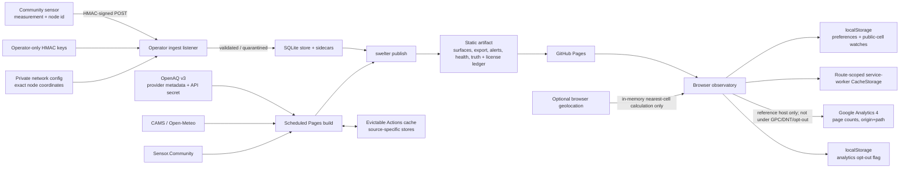

# Data-flow and retention inventory

Scope: community-operated ingestion, three live provider adapters, GitHub Pages publication, and
the browser observatory. This is the inventory behind the DPIA and threat model.

## Inventory

| Data | Purpose | Location / access | Retention and deletion | Publication |
| --- | --- | --- | --- | --- |
| First-party sensor payload | Environmental measurement ingestion | In transit to operator listener; authenticated node and steward | Raw accepted rows are append-only under collective policy; rejected payloads remain in quarantine until steward review | Aggregated/exported under collective-selected terms; raw/provisional state retained |
| Per-node HMAC key | Authenticate write requests | Mode-0600 operator file and provisioned node only | Until rotated/revoked; rerunning `node-key` replaces one node's key | Never |
| Exact host coordinate and consent reference | Place and govern a community node | Operator `network.yaml`; stewards/host according to local governance | Until node removal/host request; git history and prior open exports may be irreversible | Only the coarse cell by default; exact coordinate only after explicit host opt-in |
| Observation store and sidecars | QC, calibration, history, export, integrity | Operator filesystem; optional source-specific Actions cache | Local collective policy; Actions cache is evictable and has no durability guarantee | Selected rows/surfaces/health/alerts/export |
| OpenAQ API key | Authenticate provider fetch | GitHub Actions secret/runtime environment | Until owner rotates/deletes it; never written to artifact/store by application code | Never |
| Provider payload and license metadata | Build current reference surfaces | Build process and source-specific store/cache | Short provider query window plus accumulated evictable cache | Surface/export plus source truth and `source-license-ledger.json`; provider terms apply |
| Generated Pages artifact | Public access and offline use | GitHub Pages; public | Replaced by later deploy; copies may persist in browsers/downloads | Public by design |
| Browser geolocation | Select nearest published cell after user action | Browser memory only; application code does not send or persist raw latitude/longitude | Discarded after callback; browser/OS permission can be revoked | Never; only the selected public cell may be saved/shared |
| Browser preferences | Restore language, units, display, last public cell, comparison, shortcut choice, watch thresholds | `localStorage` key `swelter.prefs`; same-origin scripts/user | Until in-app “clear settings,” browser site-data deletion, or eviction | Not sent by application code; selected cell/time/parameter/comparison may also appear in URL fragment |
| Browser notification state | Notify once when an on-device watch crosses while page is open | In-memory set plus browser permission | Session memory only; browser owns permission retention | No push/subscriber list |
| Offline shell and same-origin data responses | PWA/offline behavior | Route-scoped service worker using origin-wide CacheStorage with a scope-derived prefix | Current release until browser deletion/eviction; activation deletes older caches owned by the same route scope | Remains on the user's device; may include third-party-licensed public environmental data |
| URL fragment | Bookmark/share parameter, time, selected public cell, comparison | Address bar/history/share target | Browser/user-controlled | Public if the user shares it; fragments are not sent in HTTP requests and are stripped from what Google Analytics receives |
| Google Analytics 4 page counts (ADR 0055) | Count visits to the reference site's pages | Google LLC (US), owner's GA4 property; loaded only on `chelseakr.github.io/swelter/`, never under GPC/DNT/opt-out | 14 months in the property; `_ga`/`_ga_CMSGSNGC9P` cookies up to two years outside the EEA/UK/CH, none inside them | Never published; origin+path, title, referring origin, browser/device data, approximate location from IP; no place, search, watch, or setting |
| Analytics opt-out flag | Remember a visitor's "Opt out of analytics" choice | `localStorage` key `swelter.analytics-opt-out`; same-origin scripts/user | Until "Opt back in", browser site-data deletion, or eviction; "Clear saved settings" deliberately leaves it | Not sent anywhere |

## Data minimization decisions

- No account, advertising id, contact list, background push subscription, or raw browser location is
  collected. The only analytics identifier is Google's `_ga` cookie from GA4 page counts on the
  reference host (ADR 0055), which is not set in the EEA/UK/CH or under GPC/DNT/opt-out, and is
  never joined to a place, search, watch, or setting.
- Observation records cannot contain a person or coordinate. Exact node placement and credentials
  remain separate operator data.
- Watches store a public cell, parameter, threshold, and UI preferences—not a person or raw
  geolocation.
- Provider data is limited to supported environmental parameters and provenance needed to use and
  license the artifact honestly.

Owner: maintainer for the reference site; hosting collective for a deployed network. Last verified:
2026-09-17. Recheck cadence: every release and whenever a field, provider, storage mechanism,
browser permission, cache, or publication path changes.
